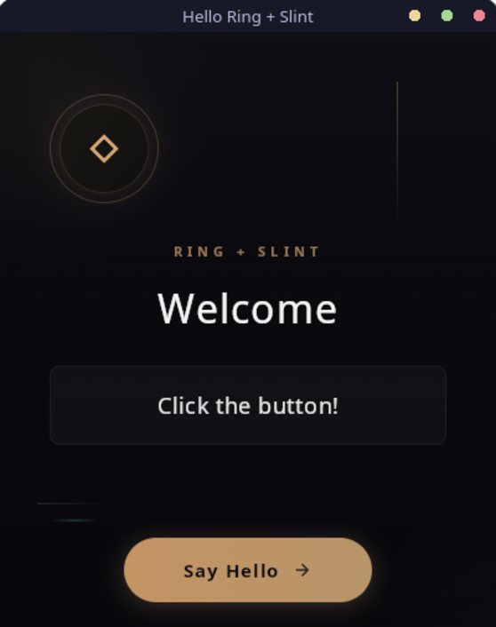
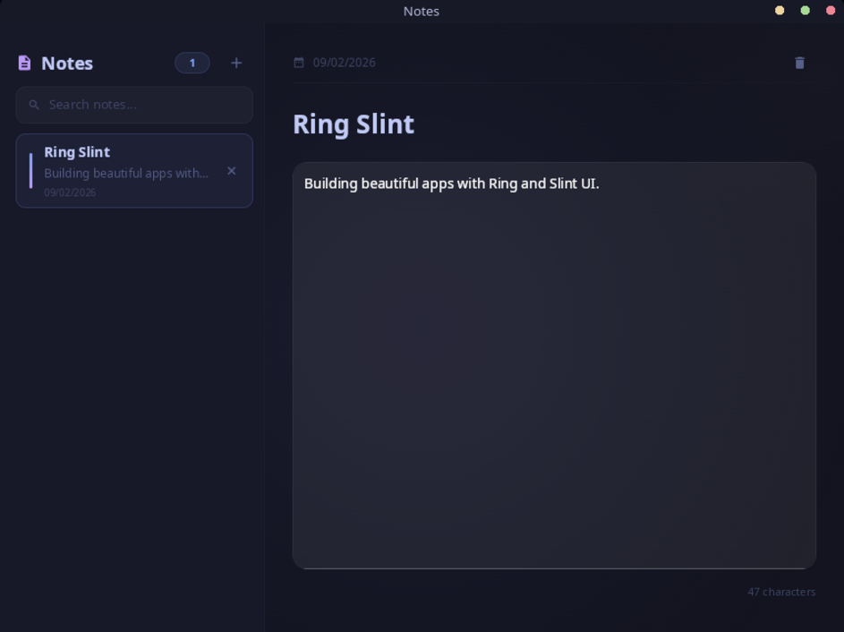

<div align="center">

# Ring Slint

Build beautiful, native applications with Ring and Slint.

[language-ring]: https://img.shields.io/badge/language-Ring-2D54CB.svg?style=for-the-badge&labelColor=414868
[build-status]: https://img.shields.io/github/actions/workflow/status/ysdragon/ring-slint/main.yml?branch=master&label=build&style=for-the-badge&labelColor=414868&logoColor=C0CAF5&color=8c73cc
[last-commit]: https://img.shields.io/github/last-commit/ysdragon/ring-slint?style=for-the-badge&logo=github&logoColor=C0CAF5&labelColor=414868&color=8c73cc
[version]: https://img.shields.io/badge/dynamic/regex?url=https%3A%2F%2Fraw.githubusercontent.com%2Fysdragon%2Fring-slint%2Fmaster%2Fpackage.ring&search=%3Aversion\s*%3D\s*%22([^%22]%2B)%22&replace=%241&style=for-the-badge&label=version&labelColor=414868&color=7664C6
[license]: https://img.shields.io/github/license/ysdragon/ring-slint?style=for-the-badge&logo=opensourcehardware&label=License&logoColor=C0CAF5&labelColor=414868&color=8c73cc
[issues]: https://img.shields.io/github/issues/ysdragon/ring-slint?color=8c73cc&style=for-the-badge&logo=github&logoColor=C0CAF5&labelColor=414868

[![][language-ring]](https://ring-lang.github.io/)
[![][build-status]](https://github.com/ysdragon/ring-slint/actions)
[![][last-commit]](https://github.com/ysdragon/ring-slint/pulse)
[![][version]](#)
[![][license]](https://github.com/ysdragon/ring-slint/blob/master/LICENSE)
[![][issues]](https://github.com/ysdragon/ring-slint/issues)

</div>

Ring Slint is a powerful Ring library that brings the [Slint](https://slint.dev/) declarative UI toolkit to the Ring programming language. Create stunning, high-performance native applications for desktop and mobile with a clean separation between UI design and application logic.

## ✨ Features

- **High Performance:** .slint files are compiled at runtime with GPU-accelerated rendering via Skia on all platforms.
- **Cross-Platform:** Build applications for Windows, macOS, Linux, FreeBSD, and Android from a single codebase.
- **Declarative UI:** Design your interface using Slint's intuitive `.slint` markup language.
- **Two-Way Binding:** Seamlessly connect Ring callbacks to Slint events and update properties dynamically.
- **Rich Widget Set:** Access Slint's built-in widgets with multiple themes (Fluent, Material, Cupertino, Native).
- **Desktop Integration:** File dialogs, message boxes, notifications, clipboard, global hotkeys, and system tray support.

## 📸 Screenshots

<div align="center">
<table>
<tr>
<td align="center"><a href="examples/01_hello.ring"></a></td>
<td align="center"><a href="examples/15_calculator.ring"></a></td>
<td align="center"><a href="examples/13_todo.ring"></a></td>
<td align="center"><a href="examples/20_notes.ring"></a></td>
</tr>
<tr>
<td align="center"><a href="examples/01_hello.ring"><b>Hello</b></a></td>
<td align="center"><a href="examples/15_calculator.ring"><b>Calculator</b></a></td>
<td align="center"><a href="examples/13_todo.ring"><b>Todo</b></a></td>
<td align="center"><a href="examples/20_notes.ring"><b>Notes</b></a></td>
</tr>
</table>
</div>

## 🚀 Getting Started

### Prerequisites

- **[Ring](https://ring-lang.github.io/download.html):** Version 1.25 or higher.

### Installation

<details>
<summary>Click here for instructions on  Linux</summary>

The library uses Skia for rendering and requires fontconfig.

*   ** Debian/Ubuntu:** `sudo apt install libfontconfig1`
*   ** Arch Linux:** `sudo pacman -S fontconfig`
*   ** Fedora:** `sudo dnf install fontconfig`
*   ** Alpine Linux:** `sudo apk add fontconfig`

</details>

<details>
<summary>Click here for instructions on  Windows</summary>

No additional dependencies required. The library is self-contained.

</details>

<details>
<summary>Click here for instructions on  FreeBSD</summary>

*   **FreeBSD:** `sudo pkg install fontconfig`

</details>

<details>
<summary>Click here for instructions on  macOS</summary>

No additional dependencies required. Uses system frameworks.

</details>

<details>
<summary>Click here for instructions on  Android</summary>

Android builds use GPU-accelerated rendering via Skia (OpenGL ES or Vulkan). Desktop-only features (file dialogs, notifications, hotkeys, system tray) are not available on Android.

**Build requirements:**
- Android NDK (r25 or later recommended)
- Rust with Android targets: `rustup target add aarch64-linux-android armv7-linux-androideabi x86_64-linux-android`
- `cargo-apk`: `cargo install cargo-apk`

**Build for Android:**
```sh
cd src/rust_src
cargo apk build --release
```

The library is configured for min SDK 21 (Android 5.0) and targets SDK 35.

**Release signing:** For release builds, configure your keystore in `src/rust_src/Cargo.toml` under `[package.metadata.android.signing.release]`:
```toml
[package.metadata.android.signing.release]
path = "/path/to/your/keystore.jks"
keystore_password = "your_password"
key_alias = "your_alias"
key_password = "your_key_password"
```

</details>

**Install the library using RingPM:**
```sh
ringpm install ring-slint from ysdragon
```

## 💻 Usage

Creating a Slint application involves two files: a `.slint` file for the UI and a `.ring` file for the logic.

**counter.slint** - Define your UI:
```slint
import { Button } from "std-widgets.slint";

export component App inherits Window {
    title: "Counter";
    width: 300px;
    height: 200px;

    callback increment();
    callback decrement();

    in-out property <int> counter: 0;

    VerticalLayout {
        alignment: center;
        spacing: 20px;

        Text {
            text: counter;
            font-size: 48px;
            horizontal-alignment: center;
        }

        HorizontalLayout {
            alignment: center;
            spacing: 10px;

            Button { text: "-"; clicked => { decrement(); } }
            Button { text: "+"; clicked => { increment(); } }
        }
    }
}
```

**counter.ring** - Add your logic:
```ring
load "slint.ring"

nCount = 0

oApp = new SlintApp {
    loadUI("counter.slint")
    setCallback("increment", :onIncrement)
    setCallback("decrement", :onDecrement)
    show()
    run()
}

func onIncrement
    nCount++
    oApp.set("counter", nCount)

func onDecrement
    nCount--
    oApp.set("counter", nCount)
```

For more examples, see the [`examples/`](examples/) directory.

## 📚 Documentation

| Document | Description |
|----------|-------------|
| **[API Reference](docs/API.md)** | Complete reference for all 94 SlintApp methods |
| **[Android Guide](docs/ANDROID.md)** | Building and deploying on Android |

### Quick Reference

| Category | Methods |
|----------|---------|
| **Core** | `loadUI()`, `loadUIString()`, `show()`, `hide()`, `run()`, `quit()` |
| **Properties** | `set()`, `setBool()`, `setString()`, `setNumber()`, `setColor()`, `setEnum()`, `getProperty()` |
| **Callbacks** | `setCallback()`, `invoke()`, `callbackArg()`, `callbackArgsCount()` |
| **Timers** | `timerStart()`, `timerStartOnce()`, `timerStop()`, `timerRestart()`, `timerRunning()`, `timerSetInterval()` |
| **Models** | `modelCreate()`, `modelPush()`, `modelInsert()`, `modelSet()`, `modelGet()`, `modelRemove()`, `modelClear()`, `modelCount()`, `modelDestroy()` |
| **Globals** | `globalGet()`, `globalSet()`, `globalSetCallback()`, `globalInvoke()` |
| **Window** | `windowSetPosition()`, `windowGetPosition()`, `windowSetSize()`, `windowGetSize()`, `windowSetMinimized()`, `windowSetMaximized()`, `windowSetFullscreen()`, `windowIsMinimized()`, `windowIsMaximized()`, `windowIsFullscreen()`, `windowIsVisible()`, `windowDrag()`, `windowSetAlwaysOnTop()`, `windowSetIcon()`, `windowRequestRedraw()`, `windowScaleFactor()` |
| **Style** | `setStyle()`, `getStyle()`, `addLibraryPath()`, `removeLibraryPath()`, `clearLibraryPaths()` |
| **Introspection** | `definitionName()`, `definitionProperties()`, `definitionCallbacks()`, `definitionFunctions()`, `definitionGlobals()` |

### Desktop-Only Features

These features are not available on Android:

| Category | Methods |
|----------|---------|
| **File Dialogs** | `fileOpen()`, `fileOpenWithFilters()`, `fileOpenMultiple()`, `fileOpenMultipleWithFilters()`, `fileSave()`, `fileSaveWithName()`, `fileSaveWithFilters()`, `folderOpen()`, `folderOpenMultiple()` |
| **Message Boxes** | `msgbox()`, `msgboxWarning()`, `msgboxError()`, `confirm()`, `yesno()` |
| **Notifications** | `notify()`, `notifyWithTimeout()`, `notifyWithIcon()`, `notifyFull()` |
| **Clipboard** | `clipboardGet()`, `clipboardSet()`, `clipboardClear()` |
| **Hotkeys** | `hotkeyRegister()`, `hotkeyUnregister()`, `hotkeyUnregisterAll()`, `hotkeyPoll()` |
| **System Tray** | `trayCreate()`, `trayCreateWithIcon()`, `traySetIcon()`, `traySetTooltip()`, `trayAddItem()`, `trayAddSeparator()`, `trayDestroy()`, `trayPoll()` |

## 🛠️ Development

### Prerequisites

- **Rust:** Latest stable version with Cargo.
- **[Ring](https://github.com/ring-lang/ring):** Fully built Ring installation (required by `ring-lang-rs` for linking).

### Build Steps

1. **Clone the Repository:**
   ```sh
   git clone https://github.com/ysdragon/ring-slint.git
   cd ring-slint
   ```

2. **Set the `RING` Environment Variable:**
   ```bash
   # Unix
   export RING=/path/to/ring

   # Windows (PowerShell)
   $env:RING = "X:\path\to\ring"
   ```

3. **Build the Rust Library:**
   ```sh
   cd src/rust_src
   cargo build --release
   ```

The compiled library will be in `src/rust_src/target/release/`.

## 🔗 Resources

- [Slint Documentation](https://slint.dev/docs)
- [Slint Language Reference](https://slint.dev/docs/slint/)
- [Ring Language](https://ring-lang.github.io/)

## 🤝 Contributing

Contributions are welcome! If you have ideas for improvements or have found a bug, please open an issue or submit a pull request.

## 📄 License

This project is licensed under the MIT License. See the [`LICENSE`](LICENSE) file for details.
